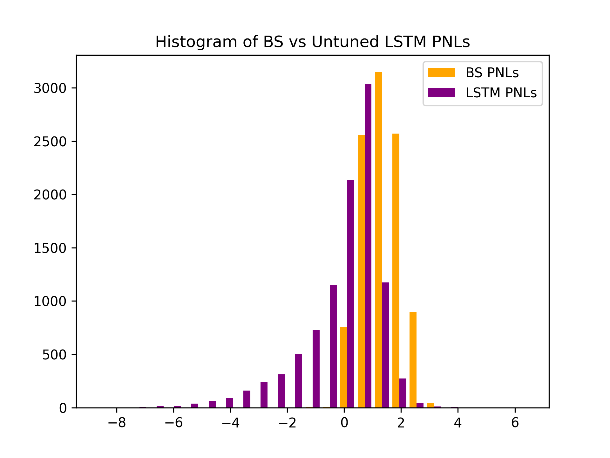

# Deep Hedging in Low-Data Environments using Path Signatures

> Honours Project — University of Cape Town, Department of Mathematics and Applied Mathematics
>
> **Author:** Nick Bossi
> **Supervisor:** Associate Professor Jonathan Shock
> **Co-Supervisor:** Yuri Robbertze

This repository contains the code, figures, and final write-up for an Honours research
project investigating whether **deep neural networks can hedge an exotic European
*Best-of* basket option more effectively than the classical Black–Scholes delta-hedging
strategy**, in a setting where real-world price data is scarce.

---

## Abstract

Historically, many approaches to hedging a financial derivative have been explored. This
project asks whether Deep Neural Networks (DNNs) can provide robust tools for hedging a
European Best-of option. Because deep-learning methods require large amounts of data — of
which there is only ever *one* historical realisation of a given instrument — we employ a
**Conditional Variational Autoencoder (CVAE)** to learn the underlying stocks'
joint conditional distribution and simulate a range of pseudo-realistic future price
paths. This serves two purposes: it provides plentiful training data for the deep hedger,
and it offers a means of stress-testing the hedger's robustness across many possible future
market conditions.

Instead of operating directly on raw time-series data, we use **path signatures** — a
feature map for sequential data that captures the key information of the joint distribution
of temporal data while being invariant to reparameterisation. Our findings indicate that
deep recurrent networks give promising results, on average producing a *more risk-neutral*
hedging strategy than strategies informed by the Black–Scholes model, though issues with
variability were also observed.

---

## The Problem

The Black–Scholes–Merton model (1973) shows that, under idealised assumptions, an option
can be perfectly hedged by continuously trading the underlying asset. Two of these
assumptions fail in reality:

1. **Frictionless markets** — there are no transaction costs.
2. **Continuous-time trading** — assets can be traded at every instant.

In practice, trading is discrete, and Black–Scholes-informed strategies do not compensate
for this. We hypothesise that a neural network — which can infer complex relationships
without explicit model assumptions — may hedge better in the **discrete-time, incomplete-market**
setting, and that **recurrent networks (LSTMs)** will outperform feed-forward networks on
this inherently sequential task.

The specific instrument studied is an **Exotic European Best-of Basket Option**:

$$H = 100\,H^*, \qquad H^* = \max\left(\frac{S^1_T}{S^1_0},\ \frac{S^2_T}{S^2_0}\right)$$

where $S^1$ and $S^2$ are the prices of two underlying stocks (Apple and Microsoft).

---

## Methodology

The pipeline has two stages: **(1)** generate realistic price paths with a CVAE over path
signatures, then **(2)** train deep hedgers on those paths and compare them to Black–Scholes.

### 1. Path generation (CVAE over log-signatures)

- **Data.** Opening prices of Apple and Microsoft over 26/06/2020–17/06/2024 (1000 trading
  days), downloaded from Yahoo! Finance.
- **Pre-processing.** The 1000 days are split into 200 two-dimensional subpaths of length
  5. For each subpath a **depth-2 log-signature** (dimension 14) is computed with the
  [`iisignature`](https://github.com/bottler/iisignature) package, then normalised to
  `[0, 1]` with `sklearn`'s `MinMaxScaler` (scaler parameters are retained for
  de-normalisation).
- **Model.** A Conditional VAE with three hidden layers (encoder / latent / decoder),
  conditioned on the previous time-period's log-signature, so as to sample from the
  *conditional* distribution of future paths given the past.

  | Hyperparameter | Value |
  |---|---|
  | KL weighting | 0.003 |
  | Latent dimension | 8 |
  | Hidden layer width | 100 |
  | Hidden activation | LeakyReLU (slope 0.3) |
  | Output activation | Sigmoid |
  | Batch size | 16 |
  | Learning rate | 3e-4 |
  | Epochs | 20 000 |

  The KL weight was deliberately lowered to avoid **latent-space collapse** (in which all
  generated samples look identical). Loss = `0.997 · MSE + 0.003 · KL`.
- **Generation.** 100 000 paths of 30 days are generated autoregressively: each path is
  produced as six conditionally-generated 5-day log-signatures, each conditioned on the
  previous one.
- **Inversion.** Log-signatures are exponentiated to signatures with `iisignature`, then
  inverted back to time-series paths with the
  [`Signatory`](https://github.com/patrick-kidger/signatory) package. Signature inversion is
  highly non-trivial; `Signatory` returns paths of length `depth + 1`, which is why 5-day
  subpaths (depth 2) were used — higher depths were computationally prohibitive.

### 2. Deep hedging

The 100 000 generated paths are split **70/20/10** into train/validation/test sets.

- **Feed-Forward hedger** — input $[S^1_t, S^2_t, T-t]$, output holdings $[\phi^1_t, \phi^2_t]$.
- **LSTM hedger** — consumes the sequence $x_0, \dots, x_{T-1}$ of $[S^1_t, S^2_t, T-t]$ vectors,
  exploiting memory for the sequential task. (The maturity day is excluded — no trade can be
  made on it.)
- **Loss.** For each path, the sum of squared tracking errors between the change in
  portfolio value and the change in the Black–Scholes option price:

$$\text{loss}_i = \sum_{t} \left[\Delta V_{i,t} - \Delta H_{i,t}\right]^2$$

  where the portfolio value $V_{i,t}$ self-finances from the initial option price $H_0$.
- **Hyperparameter search.** Conducted with [Optuna](https://optuna.org/) using validation
  loss, with median pruning (only after 10 completed runs and 10 epochs per run). 500 runs ×
  100 epochs for the feed-forward model; 100 runs × 50 epochs for the LSTM. An **untuned
  LSTM** (2 layers, no regularisation) was also trained as a sanity check.
- **Final training.** Feed-Forward, Tuned LSTM and Untuned LSTM each trained for 1000 epochs
  on the 90 000 non-test paths.

**Reproducibility.** All random seeds are fixed to `2024`.

---

## Results

### Path generation

The CVAE learns the joint conditional distribution well. A two-sample
**Kolmogorov–Smirnov test** between real and generated gains fails to reject the null
hypothesis that the distributions are the same:

| | KS statistic | p-value |
|---|---|---|
| Apple | 0.1031 | 0.2545 |
| Microsoft | 0.0515 | 0.9596 |

Conditioning is effective: generated 5-day windows are markedly closer (MSE 37.1) to the
true windows than a randomly chosen real window is (MSE 50.4).

<p align="center">
  
  
</p>
<p align="center"><em>1000 generated 30-day paths (orange) against the real continuation (blue) for Apple and Microsoft.</em></p>

### Hedging — generated test paths (10 000 paths)

| | Black–Scholes | Feed-Forward | Tuned LSTM | Untuned LSTM |
|---|---|---|---|---|
| **Mean(PNL)** | 1.3481 | 0.1780 | 1.2922 | **0.0575** |
| **Variance(PNL)** | **0.4476** | 4.9558 | 4.8277 | 1.7408 |

All neural hedgers achieve a **more risk-neutral (closer-to-zero) mean PNL** than
Black–Scholes — the Untuned LSTM by two orders of magnitude — but Black–Scholes retains the
**lowest variance**. The strong showing of the *untuned* LSTM (deeper, no regularisation)
suggests more expressive models and a better hyperparameter search would improve results
further.

<p align="center">
  
</p>
<p align="center"><em>PNL distributions: Black–Scholes vs the Untuned LSTM.</em></p>

### Hedging — final real-world 30-day test

| | Black–Scholes | Feed-Forward | Tuned LSTM | Untuned LSTM |
|---|---|---|---|---|
| **MSE( $\Delta V_t - \Delta H_t$ )** | 1.8570 | 0.7452 | **0.7262** | 1.3326 |
| **Final PNL** | −1.3963 | −4.8725 | −4.4570 | **0.5634** |

The feed-forward and tuned-LSTM portfolios track the option price most closely on average,
while the Untuned LSTM achieves the best final PNL. (This single real path is one draw from
the conditional distribution of futures, hence the additional testing on generated paths.)

---

## Conclusions

- A CVAE over path signatures **effectively learns the joint conditional distribution** of
  multiple stocks in a low-data environment, extending prior single-asset work to a
  two-asset basket setting.
- Deep hedgers can produce **more risk-neutral hedging strategies** than Black–Scholes for
  an exotic European basket option, but at the cost of **higher variance** — a partial
  agreement with the existing deep-hedging literature.
- There is clear potential for DNNs to address the shortcomings of Black–Scholes in
  incomplete, discrete-time markets, given greater compute and a more thorough search.

### Limitations & future work

- **Signature inversion** with `Signatory` precluded lead-lag transformations (which capture
  quadratic (co)variation) and restricted us to short 5-day windows. A dedicated inversion
  network, or generating raw paths directly, could help.
- **No transaction costs** were modelled; adding a holdings-change penalty to the loss would
  bring the setting closer to reality (and likely favour the DNNs further).
- **VAE hyperparameter tuning** was not formalised with a validation set.
- **Is generation necessary?** Training directly on bootstrapped real data is an open question.

---

## Repository structure

```
.
├── Stocks/                              # Data pipeline: raw prices → log-signatures → paths
│   ├── dataprocessing.py                # Load/clean Apple & Microsoft prices, build subpaths
│   ├── to_logsig.py                     # Compute (log-)signatures of subpaths
│   ├── undo_logsig.py                   # Exponentiate log-signatures back to signatures
│   ├── signature_inversion_and_plotting.py  # Invert signatures to price paths & plot
│   ├── test_generation.py               # Evaluate generated vs. real distributions (KS test)
│   └── InvertSignatorySignatures.py     # Signature-inversion utilities
├── VAE/                                 # Conditional Variational Autoencoder (path generation)
│   ├── cvae.py                          # CVAE model, training loop, sampling/generation
│   ├── automate_runs.py                 # Batch / automated training runs
│   ├── loss_plots.py                    # MSE / KL / total-loss curves
│   └── plot_paths.py                    # Plot real vs. generated stock paths
├── Hedger/                              # Deep hedging models
│   ├── Hedger_NN_hp_search_valid.py     # Feed-forward hedger + Optuna hyperparameter search
│   ├── LSTM.py                          # LSTM hedger + Optuna hyperparameter search
│   └── compare_PNLs.py                  # Compare PNLs across BS / FF / LSTM models
├── Write up/                            # LaTeX source (main.tex), figures, bibliography
├── Pictures/                            # Architecture diagrams & result figures
├── BSSNIC010_Honours_Project_Final.pdf  # Final compiled report
└── README.md
```

Data and model artifacts (`data/`, `*.npy`, `*.pkl`) are git-ignored and not committed.

The full report is in [`BSSNIC010_Honours_Project_Final.pdf`](BSSNIC010_Honours_Project_Final.pdf),
with LaTeX source in [`Write up/main.tex`](Write%20up/main.tex).

---

## Key dependencies

- Python, [PyTorch](https://pytorch.org/) (deep hedger & CVAE)
- [`iisignature`](https://github.com/bottler/iisignature) — log-signatures and exponentiation
- [`Signatory`](https://github.com/patrick-kidger/signatory) — signature inversion
- [Optuna](https://optuna.org/) — hyperparameter search
- `numpy`, `scipy`, `scikit-learn`, `matplotlib`

---

## Citation

```bibtex
@mastersthesis{bossi2024deephedging,
  author = {Bossi, Nick},
  title  = {Deep Hedging in Low-Data Environments using Path Signatures},
  school = {University of Cape Town, Department of Mathematics and Applied Mathematics},
  year   = {2024}
}
```
